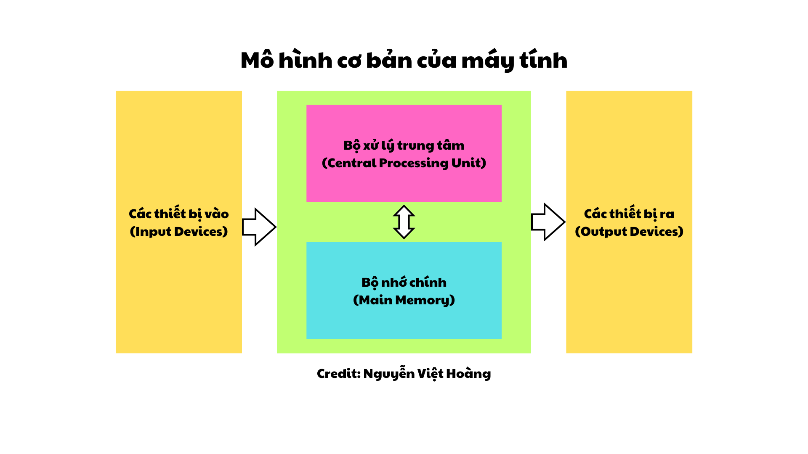

# CHƯƠNG 1. TỔNG QUAN VỀ KIẾN TRÚC MÁY TÍNH VÀ TỔ CHỨC MÁY TÍNH

---

## 1. Máy tính và phân loại

### 1.1. Máy tính

**Máy tính (Computer)** là một thiết bị điện tử được thiết kế để xử lý thông tin một cách chính xác và hiệu quả. Chúng thực hiện các chức năng cơ bản như:

1. **Nhận thông tin vào**: Tiếp nhận dữ liệu từ các thiết bị nhập (bàn phím, chuột, cảm biến, v.v.).
2. **Xử lý thông tin**: Thực hiện xử lý dữ liệu theo một dãy các lệnh được lưu trữ sẵn trong bộ nhớ.
3. **Đưa thông tin ra**: Hiển thị kết quả xử lý thông qua các thiết bị xuất (màn hình, máy in, loa, v.v.).
4. **Lưu giữ thông tin**: Lưu trữ dữ liệu và kết quả xử lý trong các thiết bị lưu trữ như ổ cứng, bộ nhớ trong, hoặc các thiết bị lưu trữ ngoài.

### 1.2. Chương trình

- **Định nghĩa**: Là dãy các lệnh hoặc câu lệnh cụ thể được lưu trữ trong bộ nhớ máy tính, nhằm hướng dẫn máy tính thực hiện một nhiệm vụ nhất định.
- **Vai trò**: Chương trình quyết định cách máy tính hoạt động, từ các tác vụ đơn giản như tính toán số học đến các tác vụ phức tạp như điều khiển hệ thống mạng hoặc chơi game.

### 1.3. Mô hình cơ bản của máy tính

Máy tính hoạt động theo nguyên tắc nhận lệnh và thực thi:

- Nhận lệnh: Thông qua chương trình, máy tính tiếp nhận yêu cầu từ người dùng hoặc thiết bị khác.
- Xử lý: CPU (bộ xử lý trung tâm) sẽ phân tích và thực hiện từng lệnh theo trình tự.
- Lưu trữ tạm thời: Trong quá trình hoạt động, các dữ liệu trung gian có thể được lưu tạm trong RAM để tăng tốc độ xử lý.
- Kết quả: Sau khi hoàn tất, máy tính sẽ đưa kết quả ra ngoài hoặc lưu trữ lâu dài trong thiết bị lưu trữ.

Trình tự xử lý thông tin của máy tính: Nhận thông tin - Xử lý thông tin - Xuất thông tin.

### 1.4. Phân loại

(Để sau)

---

## 2. Kiến trúc máy tính

---

## 3. Lịch sử phát triển của máy tính

---

## 4. Hiệu năng của máy tính

### 4.1. Hiệu năng máy tính

Định nghĩa hiệu năng P (Performance): `P = 1 / t` (trong đó `t` là thời gian thực hiện)

- Ví dụ 1: Máy tính A nhanh hơn máy tính B $n$ lần $\Rightarrow$ $P_A / P_B$ = $t_B / t_A$ = $n$
- Ví dụ 2: Thời gian chạy chương trình:
  - 10s trên máy tính A, 15s trên máy tính B.
  - $t_B / t_A$ = 15s / 10s = 1.5
  - Vậy máy tính A nhanh hơn máy tính B 1.5 lần.

### 4.2. Xung nhịp của CPU

Hoạt động của CPU được điều khiển bởi xung nhịp có tần số xác định.

- Chu kỳ xung nhịp $T_0$ (Clock period): Thời gian của một chu kỳ.
- Tần số xung nhịp $f_0$ (Clock rate): Số chu kỳ trong 1 giây.
- Công thức: $f_0$ = 1 / $T_0$

Ví dụ: Bộ xử lý có tần số xung nhịp $f_0$ = 4 GHz = 4000 MHz = $4 * 10^9$ Hz
thì suy ra chu kỳ xung nhịp $T_0$ = 1 / ($4 * 10^9$) = $0.25 * 10^{-9}$ (s) = 0.25 (ns)

### 4.3. Thời gian CPU ($t_{CPU}$)

$t_{CPU}$ = $n * T_0$ = $n / f_0$ (Trong đó $n$ là số chu kỳ xung nhịp)

Hiệu năng được tăng lên bằng cách:

- Giảm số chu kỳ xung nhịp $n$
- Tăng tần số xung nhịp $f_0$

### 4.4. Số lệnh và số chu kỳ trên một lệnh

- Số chu kỳ = Số lệnh x Số chu kỳ trên một lệnh: $n$ = $IC * CPI$, trong đó:

  - $n$: số chu kỳ
  - $IC$: số lệnh (Instruction Count)
  - $CPI$: số chu kỳ trên một lệnh (Cycles per Instruction)

- Thời gian thực hiện của CPU: $t_{CPU}$ = $IC * CPI * T_0$ = $\frac{IC * CPI}{f_0}$
  - Trong trường hợp các lệnh khác nhau có $CPI$ khác nhau, cần tính $CPI$ trung bình.
