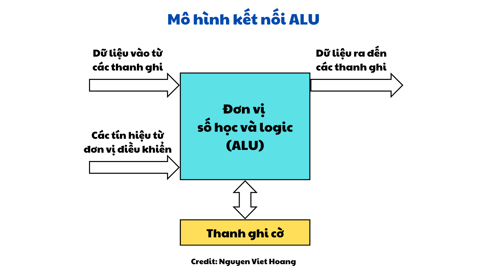

# CHƯƠNG 3: BỘ XỬ LÝ TRUNG TÂM

---

## 1. Mô hình máy tính

Các loại mô hình:

- **Havard**: Lệnh và dữ liệu được lưu trữ trên hệ thông `bộ nhớ riêng biệt`.
- **Von Neumann**: Lệnh và dữ liệu được lưu trữ `trộn lẫn trên cùng một hệ thống bộ nhớ`. Đây là mô hình chính của máy tính cá nhân hiện nay.

Hình ảnh trên là một biểu diễn cơ bản về cấu trúc của một máy tính, bao gồm các thành phần chính và cách chúng giao tiếp với nhau thông qua các `bus`. Dưới đây là giải thích chi tiết về các phần trong mô hình này:

1. **CPU (Central Processing Unit)**:

- Đây là bộ xử lý trung tâm, đóng vai trò thực hiện các phép tính và điều khiển hoạt động của toàn bộ hệ thống.
- CPU giao tiếp với các thành phần khác thông qua `Address Bus`, `Data Bus`, và `Control Bus`.

2. **Memory Subsystem**:

- Đây là hệ thống bộ nhớ, nơi `lưu trữ dữ liệu và chương trình` mà CPU cần để thực hiện các tác vụ.
- CPU sử dụng `Address Bus` để chỉ định vị trí trong bộ nhớ mà nó muốn truy cập.
- `Data Bus` được dùng để truyền dữ liệu giữa CPU và bộ nhớ.
- `Control Bus` truyền tín hiệu điều khiển để đồng bộ hóa các hoạt động.

3. **I/O Subsystem (Input/Output Subsystem)**:

- Đây là hệ thống vào/ra, bao gồm các thiết bị như bàn phím, chuột, màn hình, máy in, v.v.
- Các thiết bị này được kết nối thông qua `I/O Devices` (các thiết bị đầu vào/đầu ra).
- CPU giao tiếp với các `thiết bị I/O` thông qua các bus tương tự như giao tiếp với bộ nhớ.

4. **Bus**:

- `Address Bus`: Truyền địa chỉ từ CPU đến các thành phần khác (bộ nhớ hoặc I/O) để chỉ định vị trí dữ liệu.
- `Data Bus`: Truyền dữ liệu giữa CPU và các thành phần khác.
- `Control Bus`: Truyền các tín hiệu điều khiển để quản lý và đồng bộ hóa hoạt động của các thành phần.

5. **Mối quan hệ và giao tiếp**:

- `CPU` là trung tâm điều khiển, gửi địa chỉ và tín hiệu điều khiển để xác định và thực hiện tác vụ trên `bộ nhớ` hoặc `thiết bị I/O`.
- `Hệ thống bus` là phương tiện chính giúp các thành phần trong máy tính giao tiếp với nhau.

Mô hình này minh họa cách tổ chức cơ bản của máy tính, được gọi là `kiến trúc Von Neumann`, nơi các thành phần chính chia sẻ chung một hệ thống bus để giao tiếp.

---

## 2. Sơ đồ khối tổng quát

Hình ảnh này minh họa kiến trúc bên trong của một CPU (Central Processing Unit), với các thành phần chính và cách chúng tương tác với nhau. Dưới đây là giải thích chi tiết:

1. **Các thành phần chính của CPU**:

- `CU (Control Unit)`: Bộ điều khiển, chịu trách nhiệm điều phối hoạt động của các thành phần khác trong CPU và điều khiển luồng dữ liệu giữa CPU, bộ nhớ, và thiết bị I/O.
- `IR (Instruction Register)`: Thanh ghi lệnh, dùng để lưu trữ lệnh hiện tại mà CPU đang thực thi.
- `PC (Program Counter)`: Bộ đếm chương trình, chứa địa chỉ của lệnh tiếp theo cần thực thi.
- `MAR (Memory Address Register)`: Thanh ghi địa chỉ bộ nhớ, lưu địa chỉ bộ nhớ mà CPU muốn đọc hoặc ghi dữ liệu.
- `MBR (Memory Buffer Register)`: Thanh ghi đệm bộ nhớ, dùng để lưu dữ liệu được đọc từ bộ nhớ hoặc chuẩn bị ghi vào bộ nhớ.
- `A (Accumulator Register)`: Thanh ghi tích lũy, lưu trữ kết quả trung gian của các phép tính toán trong quá trình xử lý.
- `Y, Z (Temporary Register)`: Thanh ghi tạm thời, dùng để lưu trữ dữ liệu trong các bước trung gian của một phép tính hoặc xử lý.
- `FR (Flag Register)`: Thanh ghi cờ, lưu trạng thái của CPU (ví dụ: cờ zero, cờ carry) để hỗ trợ xử lý các điều kiện rẽ nhánh hoặc phép toán.
- `ALU (Arithmetic and Logic Unit)`: Bộ tính toán và logic, thực hiện các phép toán số học (cộng, trừ, nhân, chia) và logic (và, hoặc, phủ định).

2. **Các kết nối và Bus**:

- `A Bus (Address Bus)`: Truyền địa chỉ giữa các thành phần, đặc biệt là giữa PC, MAR và bộ nhớ.
- `D Bus (Data Bus)`: Truyền dữ liệu giữa các thanh ghi, ALU, và bộ nhớ hoặc thiết bị ngoại vi.

3. **Luồng hoạt động cơ bản**:

- Lệnh được nạp từ bộ nhớ vào IR thông qua MAR và MBR.
- PC được sử dụng để giữ địa chỉ của lệnh tiếp theo.
- Bộ điều khiển CU giải mã lệnh từ IR và điều phối hoạt động của các thanh ghi, bus, và ALU để thực hiện lệnh.
- ALU thực hiện các phép toán số học/logic dựa trên dữ liệu từ các thanh ghi như - A, Y, Z, và trạng thái được lưu trong FR.

**Tóm tắt ý nghĩa**: Sơ đồ này giúp minh họa cách CPU hoạt động, tập trung vào các bước chính của chu trình lệnh: nạp lệnh, giải mã, và thực thi. Các bus và thanh ghi đóng vai trò quan trọng trong việc lưu trữ và truyền dữ liệu nhanh chóng giữa các thành phần trong CPU.

---

## 3. Cấu trúc cơ bản của CPU

Sơ đồ cấu trúc cơ bản của CPU trong hình minh họa các thành phần chính và cách chúng tương tác qua các bus:

1. **Các thành phần chính của CPU**:

- Đơn vị điều khiển (CU - Control Unit):

  - Điều phối hoạt động của các thành phần khác trong CPU.
  - Chịu trách nhiệm giải mã lệnh và điều khiển luồng dữ liệu trong và ngoài CPU.

- Đơn vị số học và logic (ALU - Arithmetic and Logic Unit):

  - Thực hiện các phép toán số học (như cộng, trừ) và logic (như AND, OR).
  - Là thành phần xử lý chính trong CPU.

- Tập các thanh ghi (RF - Register File):

  - Là các bộ nhớ nhỏ, tốc độ cao bên trong CPU.
  - Lưu trữ dữ liệu tạm thời trong quá trình thực hiện lệnh.

- Đơn vị nối ghép bus (BIU - Bus Interface Unit):

  - Đóng vai trò trung gian giữa CPU và các thiết bị bên ngoài qua hệ thống bus.
  - Đảm bảo giao tiếp dữ liệu, địa chỉ, và điều khiển.

2. **Các loại bus**:

- Bus điều khiển: Truyền tín hiệu điều khiển từ CU tới các thành phần khác và thiết bị ngoại vi.
- Bus dữ liệu: Truyền dữ liệu giữa CPU và bộ nhớ hoặc thiết bị I/O.
- Bus địa chỉ: Truyền địa chỉ bộ nhớ hoặc thiết bị ngoại vi để đọc hoặc ghi dữ liệu.

3. **Cách hoạt động cơ bản**:

- CU điều khiển luồng dữ liệu giữa các thanh ghi trong RF, ALU, và bộ nhớ ngoài qua BIU.
- Dữ liệu và địa chỉ được truyền qua các bus tương ứng.
- ALU xử lý dữ liệu, và kết quả được lưu trữ trong RF hoặc ghi vào bộ nhớ.

---

## 4. Hoạt động của CPU

### 4.1. Nhiệm vụ của CPU

- Nhận lệnh (Fetch Instruction): CPU đọc lệnh từ bộ nhớ.
- Giải mã lệnh (Decode Instruction): Xác định thao tác mà lệnh yêu cầu.
- Nhận dữ liệu (Fetch Data): Nhận dữ liệu từ bộ nhớ hoặc các cổng vào-ra.
- Xử lý dữ liệu (Process Data): Thực hiện phép toán số học hay phép toán logic với các dữ liệu.
- Ghi dữ liệu (Write Data): Ghi dữ liệu ra bộ nhớ hay cổng vào-ra.

### 4.2. ALU - Arithmetic and Logic Unit

#### 4.2.1. Chức năng

Thực hiện các phép toán số học và phép toán logic:

- Số học: Cộng, trừ, nhân, chia, tăng, giảm, đảo dấu.
- Logic: AND, OR, XOR, NOT, phép dịch bit.

#### 4.2.2. Mô hình kết nối ALU

Hình minh họa mô tả cách kết nối và hoạt động của Đơn vị số học và logic (ALU) trong CPU. Dưới đây là các thành phần và vai trò chính:

1. **Đơn vị số học và logic (ALU)**:

- Là trung tâm thực hiện các phép toán số học (cộng, trừ, nhân, chia) và logic (AND, OR, XOR, NOT).
- Nhận tín hiệu điều khiển từ đơn vị điều khiển (CU) và dữ liệu đầu vào từ các thanh ghi để thực hiện các phép tính.

2. **Dữ liệu vào từ các thanh ghi**:

- Dữ liệu được đưa vào ALU từ các thanh ghi của CPU.
- Các thanh ghi lưu trữ tạm thời dữ liệu cần xử lý, đảm bảo ALU có thể truy cập nhanh chóng.

3. **Dữ liệu ra đến các thanh ghi**:

- Sau khi ALU thực hiện xong phép tính hoặc xử lý logic, kết quả được gửi trở lại các thanh ghi.
- Kết quả này có thể tiếp tục được sử dụng trong các phép tính tiếp theo hoặc chuyển ra ngoài.

4. **Các tín hiệu từ đơn vị điều khiển (CU)**:

- CU gửi tín hiệu điều khiển tới ALU, quyết định loại phép tính hoặc thao tác logic mà ALU cần thực hiện.
- Ví dụ: Tín hiệu điều khiển có thể yêu cầu ALU thực hiện phép cộng hai số hoặc so sánh giá trị.

5. **Thanh ghi cờ (Flag Register)**:

- Lưu trữ các cờ trạng thái do ALU tạo ra trong quá trình xử lý, như:
  - `Carry Flag (CF)`: Báo hiệu khi có số dư từ phép toán.
  - `Zero Flag (ZF)`: Xác định kết quả của phép tính là 0.
  - `Sign Flag (SF)`: Báo hiệu kết quả là số âm.

### 4.3. CU - Control Unit

#### 4.3.1. Chức năng

- Điều khiển nhận lệnh từ bộ nhớ đưa vào thanh ghi lệnh.
- Tăng nội dung của PC để trỏ sang lệnh kế tiếp.
- Giải mã lệnh đã được nhận để xác định thao tác mà lệnh yêu cầu.
- Phát ra các tín hiệu điều khiển thực hiện lệnh.
- Nhận các tín hiệu yêu cầu từ bus hệ thống và đáp ứng các yêu cầu đó.

#### 4.3.2. Mô hình kết nối CU

#### 4.3.3. Tập thanh ghi

#### 4.3.4. Bus

- Bus: tập các dây kết nối các thành phần của máy tính.
- Các loại bus:
  - Bus địa chỉ: Xác định vùng nhớ hay thiết bị ngoại vi mà CPU cần truy xuất, luôn nhận dữ liệu từ CPU.
  - Bus dữ liệu: Tải dữ liệu từ CPU đến bộ nhớ và ngược lại.
  - Bus điều khiển: Truyền tải các lệnh điều khiển.

1. **Bus địa chỉ**

- Chức năng: Vận chuyển địa chỉ để xác định ngăn nhớ hay cổng vào-ra.
- Độ rộng bus địa chỉ: Xác định dung lượng bộ nhớ cực đại của hệ thống.
  Nếu độ rộng bus địa chỉ là N bit: $A_{N-1}$, $A_{N-2}$, ..., $A_2$, $A_1$, $A_0$
  $\Rightarrow$ Có thể đánh địa chỉ tối đa cho $2^N$ ngăn nhớ.
- Ví dụ: Bộ xử lý Pentium có bus địa chỉ 32 bit thì không gian địa chỉ là $2^{32}$ byte = 4 GBytes (đánh địa chỉ theo byte)

2. **Bus dữ liệu**

- Chức năng:
  - Vận chuyển lệnh từ bộ nhớ đến CPU.
  - Vận chuyển dữ liệu giữa CPU, các mô đun nhớ và mô đun vào-ra với nhau.
- Độ rộng bus dữ liệu: Xác định số bit dữ liệu có thể được trao đổi đồng thời.
  - M bit: $D_{M-1}$, $D_{M-2}$, ..., $D_2$, $D_1$, $D_0$
  - M thường là 8, 16, 32, 64, 128 bit.
- Ví dụ: Các bộ xử lý Pentium có bus dữ liệu 64 bit.

3. **Bus điều khiển**

- Chức năng: Vận chuyển các tín hiệu điều khiển.
- Các loại tín hiệu điều khiển:
  - Các tín hiệu phát ra từ CPU để điều khiển mô-đun nhớ và mô-đun vào-ra.
  - Các tín hiệu từ mô-đun nhớ hay mô-đun vào-ra gửi đến yêu cầu CPU.

---

## 5. Chu trình lệnh

### 5.1. Chu trình lệnh trong 10 bước

1. **Hệ điều hành nạp chương trình vào bộ nhớ trong**:

> Khi chạy chương trình, hệ điều hành sẽ đưa chương trình từ bộ nhớ ngoài (như ổ đĩa) vào bộ nhớ trong (RAM) để CPU có thể xử lý.

2. **Địa chỉ của câu lệnh đầu tiên được đặt vào thanh ghi PC (Program Counter)**:

> PC giữ địa chỉ của câu lệnh đầu tiên của chương trình. Đây là bước khởi tạo để CPU biết bắt đầu từ đâu.

3. **Địa chỉ ô nhớ chứa câu lệnh được chuyển vào bus địa chỉ qua thanh ghi MAR (Memory Address Register)**:

> Địa chỉ trong PC được chuyển vào MAR, từ đó được gửi tới bus địa chỉ để CPU có thể truy cập bộ nhớ.

4. **Bus địa chỉ chuyển địa chỉ lệnh tới đơn vị quản lý bộ nhớ MMU (Memory Management Unit)**:

> MMU chuyển địa chỉ logic từ CPU thành địa chỉ vật lý trong bộ nhớ.
> MMU xác định ô nhớ chứa lệnh tương ứng.

5. **MMU chọn ô nhớ chứa lệnh và yêu cầu tín hiệu đọc từ CPU**:

> CPU gửi tín hiệu yêu cầu đọc lệnh từ ô nhớ mà MMU đã chỉ định.

6. **Lệnh được chuyển từ ô nhớ vào thanh ghi MBR (Memory Buffer Register)**:

> Lệnh được nạp từ RAM vào thanh ghi MBR thông qua bus dữ liệu để chuẩn bị gửi đến thanh ghi lệnh (IR).

7. **MBR chuyển lệnh tới thanh ghi lệnh IR (Instruction Register) và sau đó tới CU (Control Unit)**:

> Lệnh được lưu trong IR, sau đó CU sẽ xử lý và giải mã nội dung của lệnh.

8. **CU giải mã câu lệnh và tạo tín hiệu điều khiển**:

> CU giải mã lệnh để xác định thao tác cần thực hiện, đồng thời gửi tín hiệu tới các đơn vị thực thi như ALU hoặc bộ nhớ.

9. **Giá trị thanh ghi PC tăng lên 1**:

> Sau khi giải mã lệnh, PC được tăng giá trị để trỏ đến câu lệnh tiếp theo trong chương trình.

10. **Lặp lại quá trình**:

> Các bước 2 - 9 được lặp lại cho đến khi tất cả các lệnh trong chương trình được xử lý hoặc chương trình kết thúc.

### 5.2. Hoạt động của chu trình lệnh (tóm lược)

Chu trình lệnh có thể được chia thành các bước chính như sau:

- **Nhận lệnh** (Fetch): CPU truy xuất lệnh từ bộ nhớ chính vào thanh ghi lệnh IR.
- **Giải mã lệnh** (Decode): CU phân tích và giải mã lệnh, xác định cần thực hiện tác vụ nào.
- **Nhận toán hạng** (Fetch Operand): Nếu lệnh yêu cầu toán hạng (dữ liệu), CPU truy xuất toán hạng từ bộ nhớ hoặc thanh ghi.
- **Thực hiện lệnh** (Execute): CPU thực hiện lệnh, có thể là phép toán, đọc/ghi dữ liệu hoặc thay đổi trạng thái thanh ghi.
- **Cất toán hạng** (Write Back): Kết quả của lệnh được lưu trở lại bộ nhớ hoặc thanh ghi.
- **Ngắt** (Interrupt – nếu có): CPU kiểm tra và xử lý tín hiệu ngắt trước khi quay lại thực hiện lệnh tiếp theo.
  Quá trình này lặp lại cho đến khi chương trình kết thúc.

1. **Nhận lệnh**
   

- CPU đưa địa chỉ của lệnh cần nhận từ bộ đếm chương trình PC ra bus địa chỉ.
- CPU phát tín hiệu điều khiển đọc bộ nhớ.
- Lệnh từ bộ nhớ được đặt lên bus dữ liệu và được CPU copy vào thanh ghi lệnh IR.
- CPU tăng nội dung PC để trỏ sang lệnh kế tiếp.

2. **Giải mã lệnh**

- Lệnh từ thanh ghi lệnh IR được đưa đến đơn vị điều khiển.
- Đơn vị điều khiển tiến hành giải mã lệnh để xác định thao tác phải thực hiện.
- Giải mã lệnh xảy ra bên trong CPU.

3. **Nhận dữ liệu từ bộ nhớ**

- CPU đưa địa chỉ của toán hạng ra bus địa chỉ.
- CPU phát tín hiệu điều khiển đọc.
- Toán hạng được đọc vào CPU.
- Tương tự như nhận lệnh

4. **Thực hiện lệnh**

- Có nhiều dạng tuỳ thuộc vào lệnh.
- Có thể là:
  - Đọc/Ghi bộ nhớ.
  - Vào/Ra.
  - Chuyển giữa các thanh ghi.
  - Thao tác số học/logic.
  - Chuyển điều khiển (rẽ nhánh).

5. **Ghi toán hạng**

- CPU đưa địa chỉ ra bus địa chỉ.
- CPU đưa dữ liệu cần ghi ra bus dữ liệu.
- CPU phát tín hiệu điều khiển ghi.
- Dữ liệu trên bus dữ liệu được copy đến vị trí xác định.

6. **Ngắt**

- Nội dung của bộ đếm chương trình PC (địa chỉ trở về sau khi ngắt) được đưa ra bus dữ liệu.
- CPU đưa địa chỉ (thường được lấy từ con trỏ ngăn xếp SP) ra bus địa chỉ.
- CPU phát tín hiệu điều khiển ghi bộ nhớ.
- Địa chỉ trở về trên bus dữ liệu được ghi ra vị trí xác định (ở ngăn xếp).
- Địa chỉ lệnh đầu tiên của chương trình con điều khiển ngắt được nạp vào PC.
