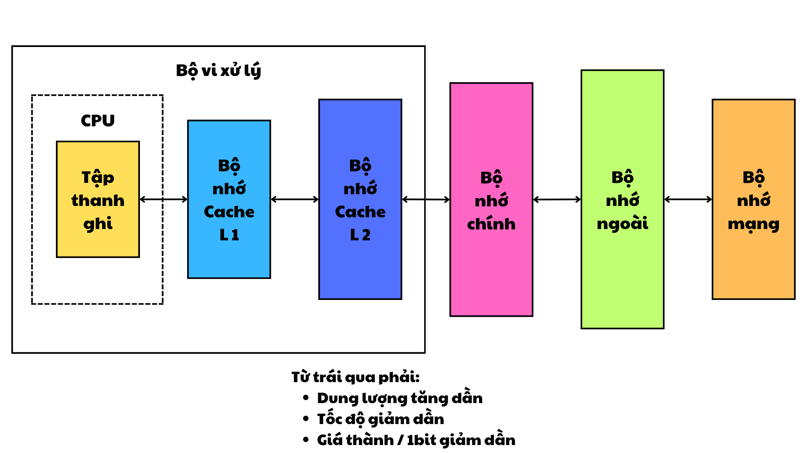
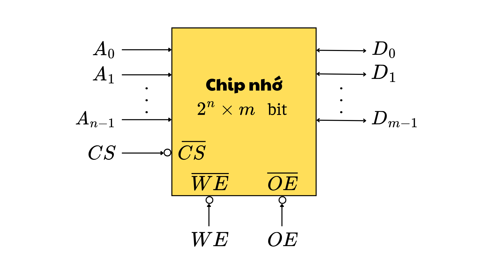
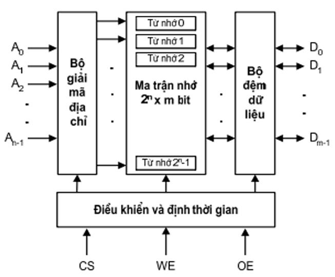
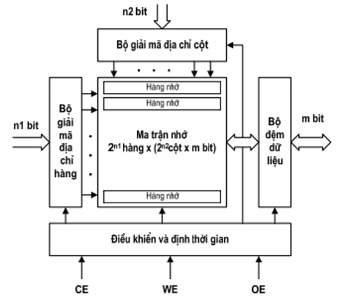

# CHƯƠNG 4: BỘ NHỚ MÁY TÍNH

---

## 1. Tổng quan về hệ thống nhớ

### 1.1. Các đặc trưng của hệ thống nhớ

#### **Vị trí**

Hệ thống nhớ được phân loại dựa trên vị trí vật lý của nó trong hệ thống máy tính:

- **Bên trong CPU: Tập thanh ghi**

  - Tập thanh ghi (_register_) là một loại bộ nhớ nhỏ, tốc độ cao nằm ngay trong CPU. Nó được dùng để lưu trữ tạm thời các dữ liệu và lệnh trong quá trình xử lý. Tập thanh ghi có dung lượng rất nhỏ nhưng lại cực kỳ nhanh, giúp CPU truy xuất dữ liệu ngay lập tức.

- **Bộ nhớ trong**

  - **Bộ nhớ chính** (_main memory_): Là nơi lưu trữ dữ liệu và chương trình đang được thực thi. Bộ nhớ này thường là RAM, có tốc độ truy cập nhanh hơn so với bộ nhớ ngoài nhưng chậm hơn tập thanh ghi.
  - **Bộ nhớ cache**: Là một loại bộ nhớ tạm thời tốc độ cao, nằm giữa CPU và RAM. Bộ nhớ này lưu trữ các dữ liệu và lệnh thường xuyên được sử dụng để giảm thời gian truy cập từ CPU tới RAM.

- **Bộ nhớ ngoài**
  - Là các thiết bị lưu trữ có dung lượng lớn, dùng để lưu trữ lâu dài các dữ liệu và chương trình, ví dụ như ổ cứng, USB, CD/DVD. Bộ nhớ ngoài có tốc độ truy cập chậm hơn so với bộ nhớ trong nhưng có dung lượng lớn hơn nhiều.

#### **Dung lượng**

Dung lượng của bộ nhớ được xác định bởi các yếu tố sau:

- **Độ dài từ nhớ**
  - Một từ nhớ (_word_) thường bao gồm 16, 32, hoặc 64 bit, tùy thuộc vào kiến trúc hệ thống. Độ dài này quyết định khả năng xử lý và truyền dữ liệu của hệ thống.
- **Số lượng từ nhớ**
  - Tổng số từ nhớ mà bộ nhớ có thể lưu trữ. Điều này thể hiện khả năng lưu trữ của bộ nhớ và thường được đo bằng MB, GB hoặc TB.

#### **Đơn vị truyền**

Đơn vị truyền xác định cách dữ liệu được truyền đi trong hệ thống:

- **Từ nhớ (word)**: Là đơn vị cơ bản của dữ liệu được CPU xử lý, thường có kích thước bằng độ dài từ nhớ (16, 32, hoặc 64 bit).
- **Khối nhớ (block)**: Là đơn vị dữ liệu lớn hơn, thường được sử dụng trong bộ nhớ ngoài (ổ cứng, USB). Một khối nhớ có thể chứa nhiều từ nhớ.

#### **Phương pháp truy nhập**

Phương pháp truy nhập thể hiện cách dữ liệu được lấy từ bộ nhớ:

- **Truy nhập tuần tự (bằng từ)**
  - Dữ liệu được truy xuất theo thứ tự từ vị trí này đến vị trí khác, ví dụ như trong băng từ. Phương pháp này có tốc độ chậm do phải duyệt qua toàn bộ dữ liệu.
- **Truy nhập trực tiếp (các loại đĩa)**
  - Cho phép truy xuất dữ liệu tại một vị trí bất kỳ mà không cần đọc toàn bộ dữ liệu trước đó. Ví dụ: ổ cứng hoặc đĩa CD.
- **Truy nhập ngẫu nhiên (bộ nhớ bán dẫn)**
  - CPU có thể truy cập trực tiếp vào bất kỳ vị trí nhớ nào mà không cần theo thứ tự. RAM là một ví dụ điển hình.
- **Truy nhập liên kết (cache)**
  - Dữ liệu được truy cập thông qua cơ chế ánh xạ để tăng tốc độ truy cập vào dữ liệu thường dùng.

#### **Hiệu năng**

Hiệu năng của bộ nhớ được đánh giá qua các chỉ số sau:

- **Thời gian truy nhập**
  - Là thời gian cần thiết để đọc hoặc ghi dữ liệu vào bộ nhớ. Bộ nhớ càng nhanh thì thời gian truy nhập càng ngắn.
- **Chu kỳ nhớ**
  - Thời gian giữa hai lần truy xuất liên tiếp vào bộ nhớ. Chu kỳ này bao gồm cả thời gian truy nhập và thời gian chờ sẵn sàng.
- **Tốc độ truyền**
  - Là tốc độ mà dữ liệu được truyền từ bộ nhớ đến CPU hoặc ngược lại. Tốc độ truyền càng cao thì hệ thống hoạt động càng hiệu quả.

#### **Kiểu vật lý**

Bộ nhớ có thể được phân loại dựa trên công nghệ chế tạo:

- **Bộ nhớ bán dẫn**
  - Bao gồm RAM và ROM, sử dụng công nghệ bán dẫn để lưu trữ dữ liệu.
- **Bộ nhớ từ**
  - Bao gồm ổ đĩa cứng (HDD) và băng từ, lưu trữ dữ liệu bằng cách sử dụng từ tính.
- **Bộ nhớ quang**
  - Sử dụng ánh sáng laser để đọc và ghi dữ liệu, ví dụ: CD, DVD, Blu-ray.

#### **Các đặc tính vật lý**

Bộ nhớ cũng có các đặc tính sau:

- **Khả biến/Không khả biến**
  - **Khả biến (Volatile)**: Dữ liệu bị mất khi nguồn điện bị ngắt, ví dụ: RAM.
  - **Không khả biến (Non-volatile)**: Dữ liệu được giữ nguyên khi mất điện, ví dụ: ROM, ổ SSD.
- **Xoá được/Không xoá được**
  - **Xoá được**: Có thể xóa và ghi lại dữ liệu nhiều lần, ví dụ: Flash Memory, RAM.
  - **Không xoá được**: Dữ liệu không thể thay đổi sau khi ghi, ví dụ: PROM.

#### **Tổ chức**

Tổ chức bộ nhớ liên quan đến cách dữ liệu được sắp xếp và quản lý:

- **Phân cấp**
  - Hệ thống nhớ được tổ chức thành nhiều cấp, từ cấp nhanh nhất và nhỏ nhất (cache) đến cấp lớn nhất và chậm nhất (ổ cứng).
- **Đơn vị lưu trữ**
  - Dữ liệu được lưu trữ và quản lý theo byte, từ nhớ (_word_), hoặc khối nhớ (_block_).
- **Quản lý địa chỉ**
  - Hệ thống sử dụng địa chỉ logic (được phần mềm yêu cầu) và địa chỉ vật lý (thực tế trên phần cứng) để truy cập dữ liệu.

### 1.2. Phân cấp hệ thống nhớ

---

## 2. Bộ nhớ bán dẫn

### 2.1. Phân loại

<table>
  <tr>
    <th>Kiểu bộ nhớ</th>
    <th>Tiêu chuẩn</th>
    <th>Khả năng xóa</th>
    <th>Cơ chế ghi</th>
    <th>Tính khả biến</th>
  </tr>
  <tr>
    <td>Read Only Memory (ROM)</td>
    <td rowspan="2">Bộ nhớ chỉ đọc</td>
    <td rowspan="2">Không xóa được</td>
    <td>Mặt nạ</td>
    <td rowspan="5">Không khả biến</td>
  </tr>
  <tr>
    <td>Programmable ROM (PROM)</td>
    <td rowspan="5">Bằng điện</td>
  </tr>
  <tr>
    <td>Erasable PROM (EPROM)</td>
    <td rowspan="2">Bộ nhớ hầu như chỉ đọc</td>
    <td>Bằng tia cực tím, cả chip</td> 
  </tr>
  <tr>
    <td>Electrically Erasable PROM (EEPROM)</td>
    <td>Bằng điện, mức từng byte</td>
  </tr>
  <tr>
    <td>Flash Memory</td>
    <td rowspan="2">Bộ nhớ đọc-ghi</td>
    <td>Bằng điện, mức từng khối</td>
  </tr>
  <tr>
    <td>Random Access Memory (RAM)</td>
    <td>Bằng điện, mức từng byte</td>
    <td>Khả biến</td>
  </tr>
</table>

### 2.2. ROM (Read-Only Memory)

- Bộ nhớ không khả biến.
- Lưu trữ các thông tin sau:

  - Thư viện các chương trình con.
  - Các chương trình điều khiển hệ thống (BIOS).
  - Các bảng chức năng.
  - Vi chương trình.

- Các kiểu ROM:
<table>
  <thead>
    <tr>
      <th>Kiểu ROM</th>
      <th>Đặc điểm</th>
    </tr>
  </thead>
  <tbody>
    <tr>
      <td>ROM mặt nạ</td>
      <td>
        <ul>
          <li>Thông tin được ghi khi sản xuất.</li>
          <li>Rất đắt.</li>
        </ul>
      </td>
    </tr>
    <tr>
      <td>PROM (Programmable ROM)</td>
      <td>
        <ul>
          <li>Cần thiết bị chuyên dụng để ghi bằng chương trình &rarr; chỉ ghi được 1 lần.</li>
        </ul>
      </td>
    </tr>
    <tr>
      <td>EPROM (Erasable ROM)</td>
      <td>
        <ul>
          <li>Cần thiết bị chuyên dụng để ghi bằng chương trình &rarr; ghi được nhiều lần.</li>
          <li>Trước khi ghi lại, xoá bằng tia cực tím.</li>
        </ul>
      </td>
    </tr>
    <tr>
      <td>EEPROM (Electrically Erasable ROM)</td>
      <td>
        <ul>
          <li>Có thể ghi theo từng byte.</li>
          <li>Xoá bằng điện.</li>
        </ul>
      </td>
    </tr>
    <tr>
      <td>Flash Memory (Bộ nhớ cực nhanh)</td>
      <td>
        <ul>
          <li>Ghi theo khối.</li>
          <li>Xoá bằng điện.</li>
        </ul>
      </td>
    </tr>
  </tbody>
</table>

### 2.3. RAM (Random Access Memory)

- Bộ nhớ đọc-ghi (Read/Write Memory)
- Bộ nhớ khả biến.
- Lưu trữ thông tin tạm thời.
- Có 2 loại: SRAM và DRAM.

<table>
  <thead>
    <tr>
      <th>Đặc điểm</th>
      <th>SRAM (Static RAM) - RAM tĩnh</th>
      <th>DRAM (Dynamic RAM) - RAM động</th>
    </tr>
  </thead>
  <tbody>
    <tr>
      <td>Cách lưu trữ</td>
      <td>Các bit được lưu trữ bằng các Flip-Flop &rarr; Thông tin ổn định.</td>
      <td>Các bit được lưu trữ trên tụ điện &rarr; Cần phải có mạch làm tươi.</td>
    </tr>
    <tr>
      <td>Cấu trúc</td>
      <td>Phức tạp.</td>
      <td>Đơn giản.</td>
    </tr>
    <tr>
      <td>Dung lượng</td>
      <td>Nhỏ.</td>
      <td>Lớn.</td>
    </tr>
    <tr>
      <td>Tốc độ</td>
      <td>Nhanh.</td>
      <td>Chậm hơn.</td>
    </tr>
    <tr>
      <td>Chi phí</td>
      <td>Đắt tiền.</td>
      <td>Rẻ tiền hơn.</td>
    </tr>
    <tr>
      <td>Ứng dụng</td>
      <td>Dùng làm bộ nhớ cache.</td>
      <td>Dùng làm bộ nhớ chính.</td>
    </tr>
  </tbody>
</table>

- Các DRAM tiên tiến
  - **Enhanced DRAM (EDRAM)**: DRAM cải tiến với bộ điều khiển logic tích hợp, tăng hiệu năng xử lý.
  - **Cache DRAM (CDRAM)**: DRAM có tích hợp bộ nhớ cache, giảm độ trễ trong việc truy cập dữ liệu.
  - **Synchronous DRAM (SDRAM)**: DRAM đồng bộ với xung nhịp đồng hồ, tăng tốc độ truyền dữ liệu.
  - **DDR-SDRAM (Double Data Rate SDRAM)**: Phiên bản SDRAM cải tiến, truyền dữ liệu trên cả hai cạnh của xung đồng hồ (tăng gấp đôi băng thông).
  - **Rambus DRAM (RDRAM)**: DRAM có kênh truyền tải tốc độ cao, thiết kế dành cho băng thông lớn và hiệu năng cao.

### 2.4. Tổ chức của chip nhớ

#### 2.4.1. Sơ đồ cơ bản của chip nhớ

#### 2.4.2. Các tín hiệu của chip nhớ

- Các đường địa chỉ ($A_{n-1}$ đến $A_0$):

  - **Chức năng:** Các đường địa chỉ được sử dụng để chọn một ô nhớ cụ thể trong chip nhớ.
  - **Số lượng từ nhớ:** Vì chip nhớ có $n$ đường địa chỉ, nó có thể truy cập $2^n$ từ nhớ (mỗi từ là một tập hợp các bit dữ liệu).

- Các đường dữ liệu ($D_{m-1}$ đến $D_0$):

  - **Chức năng:** Các đường dữ liệu được sử dụng để truyền dữ liệu ra khỏi hoặc vào chip nhớ.
  - **Độ dài từ nhớ:** Mỗi từ nhớ có chiều dài $m$ bit, nghĩa là chip nhớ có thể xử lý dữ liệu có $m$ bit mỗi lần.

- Dung lượng chip nhớ:

  - Công thức dung lượng của chip nhớ là:
    \[
    \text{Dung lượng} = 2^n \times m \, \text{bit}.
    \]
  - Trong đó:
    - $2^n$: Số từ nhớ.
    - $m$: Số bit trên mỗi từ nhớ.

- Các đường điều khiển:

  - **Tín hiệu chọn chip (CS - Chip Select):**

    - **Chức năng:** Kích hoạt hoặc vô hiệu hóa chip nhớ.
    - **Hoạt động:** Khi $\overline{\text{CS}} = 0$, chip nhớ được chọn và có thể hoạt động; nếu \( \overline{\text{CS}} = 1 \), chip nhớ bị vô hiệu hóa.

  - **Tín hiệu điều khiển đọc (OE - Output Enable):**

    - **Chức năng:** Kích hoạt việc đọc dữ liệu từ chip nhớ.
    - **Hoạt động:** Khi $\overline{\text{OE}} = 0$, dữ liệu từ chip nhớ sẽ được truyền ra ngoài qua các đường dữ liệu.

  - **Tín hiệu điều khiển ghi (WE - Write Enable):**
    - **Chức năng:** Kích hoạt việc ghi dữ liệu vào chip nhớ.
    - **Hoạt động:** Khi $\overline{\text{WE}} = 0$, dữ liệu từ các đường dữ liệu sẽ được ghi vào vị trí nhớ được chọn.

- Tích cực ở mức 0:

  - Các tín hiệu điều khiển (CS, OE, WE) là **tích cực ở mức thấp**, nghĩa là chúng chỉ hoạt động khi có mức logic 0.

- Người dùng cần phối hợp các tín hiệu điều khiển $\overline{\text{CS}}, \overline{\text{OE}}, \overline{\text{WE}}$ để thực hiện các thao tác đọc và ghi dữ liệu.

#### 2.4.3. Tổ chức bộ nhớ một chiều

#### 2.4.4. Tổ chức bộ nhớ hai chiều

Bộ nhớ hai chiều là cách tổ chức dữ liệu trong chip nhớ để tối ưu hóa việc truy cập và quản lý địa chỉ.

- Các thành phần chính

  - **Ma trận nhớ:**

    - Bao gồm $2^{n1}$ hàng và $2^{n2}$ cột.
    - Mỗi từ nhớ có độ dài $m$ bit.

  - **Bộ giải mã địa chỉ hàng (Row Decoder):**

    - Nhận tín hiệu từ $n1$ bit địa chỉ.
    - Chọn một trong $2^{n1}$ hàng trong ma trận nhớ.

  - **Bộ giải mã địa chỉ cột (Column Decoder):**

    - Nhận tín hiệu từ $n2$ bit địa chỉ.
    - Chọn một trong $2^{n2}$ từ nhớ (cột) trong hàng đã chọn.

  - **Bộ đệm dữ liệu:**

    - Đọc dữ liệu từ ma trận nhớ ra ngoài hoặc ghi dữ liệu vào ma trận nhớ.
    - Độ rộng $m$ bit.

  - **Bộ điều khiển và định thời:**
    - Điều khiển các tín hiệu như CE (Chip Enable), WE (Write Enable), và OE (Output Enable).
    - Đồng bộ hóa hoạt động đọc/ghi dữ liệu.

- Số lượng địa chỉ

  - **Tổng số đường địa chỉ:**
    $$
    n = n1 + n2
    $$
  - **Phân bổ đường địa chỉ:**
    - n1: Chọn $2^{n1}$ hàng.
    - n2: Chọn $2^{n2}$ cột trong mỗi hàng.

- Dung lượng bộ nhớ

  - Dung lượng tổng của chip nhớ được tính bằng công thức:
    $$
    \text{Dung lượng} = 2^{n1} \times 2^{n2} \times m = 2^{n} \times m \, \text{bit}.
    $$
  - Trong đó:
    - $2^{n1}$: Số hàng.
    - $2^{n2}$: Số từ nhớ trong mỗi hàng.
    - $m$: Độ dài mỗi từ nhớ (số bit).

- Hoạt động giải mã địa chỉ

  - **Bước 1:** Bộ giải mã hàng nhận $n1$ bit đầu tiên của địa chỉ và chọn một hàng trong \( 2^{n1} \) hàng.
  - **Bước 2:** Bộ giải mã cột nhận $n2$ bit còn lại của địa chỉ và chọn một từ nhớ trong hàng đã chọn.
  - **Kết quả:** Truy cập chính xác vào một từ nhớ trong ma trận.

- Các tín hiệu điều khiển

  - **CE (Chip Enable):** Kích hoạt chip nhớ để bắt đầu hoạt động.
  - **WE (Write Enable):** Cho phép ghi dữ liệu vào từ nhớ được chọn.
  - **OE (Output Enable):** Cho phép xuất dữ liệu từ từ nhớ ra ngoài.

- Ưu điểm tổ chức hai chiều
  - **Tối ưu hóa địa chỉ:** Chia nhỏ địa chỉ thành hàng và cột giúp giảm số lượng đường dây cần thiết.
  - **Hiệu suất cao:** Việc tổ chức ma trận cho phép truy cập nhanh đến từng từ nhớ.
  - **Quy mô lớn:** Tăng dung lượng bộ nhớ mà không cần tăng số lượng đường địa chỉ nhiều.
